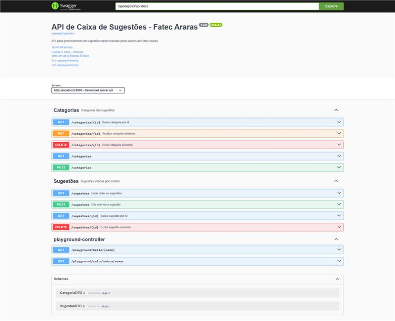
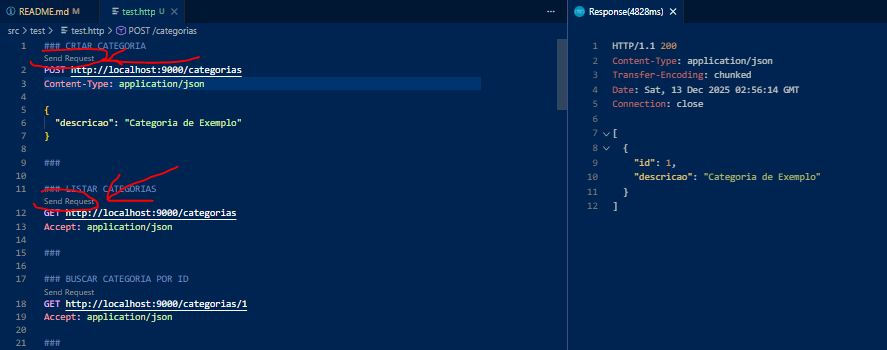

# 📦 API de Caixa de Sugestões  
### API REST — Spring Boot 3.5.7 | Fatec Araras

Este projeto é uma **API REST desenvolvida em Spring Boot 3.5.7 (Java 17)** para gerenciamento de **Categorias** e **Sugestões**, aplicando boas práticas de arquitetura, validações, regras de negócio, tratamento global de exceções e **documentação automática com Springdoc OpenAPI (Swagger)**.

---
### 📊 Status do Projeto
<!--  -->
<h3 align="center">✅ Concluído ✅</h3>
<!-- <h3 align="center">🚧🚧 Em construção!  👷 🧱🚧</h3> -->


## 🖼️ Visão Geral dos Endpoints

A imagem abaixo apresenta **todos os endpoints disponíveis na API**.

🔗 **Imagem dos Endpoints:**  



---

## 🚀 Funcionalidades

- CRUD completo de **Categorias**
- CRUD completo de **Sugestões**
- Tratamento global de exceções (`GlobalExceptionHandler`)
- Regra de negócio com `RegraDeNegocioException`
- Documentação automática com **Swagger / OpenAPI**
- Log automático de rotas (`EndpointLogger`)
- Endpoints de playground
- Test com RestClient

---

## 📦 Tecnologias Utilizadas

- Java 17
- Spring Boot 3.5.7
- Gradle (Wrapper)

---

## ▶️ Como Executar

```bash
./gradlew bootRun
```

A aplicação iniciará em:

```
http://localhost:9000
```

---

## 📄 Documentação da API

- Swagger UI  
  http://localhost:9000/openapi/swagger-ui.html

- OpenAPI JSON  
  http://localhost:9000/openapi/v3/api-docs

- OpenAPI YAML  
  http://localhost:9000/openapi/v3/api-docs.yaml

---

## 🧪 Testes das Rotas

O projeto possui um arquivo de testes pronto:

```
src/test/test.http
```

Esse arquivo deve ser executado com a extensão  , instalada, para testar todas as rotas da API.

Como executar os testes ?

Abra o arquivo `test.http` no VS Code e clique em "Send Request", no endpoint que deseja testar.

Exemplo:



Esse arquivo pode ser utilizado com o **VS Code REST Client** para testar todas as rotas da API.

---

## 📁 Estrutura do Projeto
```bash
📁 caixasugestoes/
        ├─ 📁 src/
        │  ├─ 📁 main/
        │  │  ├─  📁 java/
        │  │  │  └─ 📁 dev/
        │  │  │     └─ 📁 sdras/
        │  │  │        └─ 📁 caixasugestoes/
        │  │  │           ├─ 📁 config/
        │  │  │           │  ├─  📁 exception/
        │  │  │           │  │  ├─ 📄 ApiError.java
        │  │  │           │  │  ├─ 📄 GlobalExceptionHandler.java
        │  │  │           │  │  ├─ 📄 RecursoNaoLocalizadoException.java
        │  │  │           │  │  └─ 📄 RegraDeNegocioException.java
        │  │  │           │  ├─ 📄 AppConfig.java
        │  │  │           │  └─ 📄 EndpointLogger.java # Arquivo que lista os endpoints no terminal.
        │  │  │           ├─  📁domain/
        │  │  │           │  ├─ 📁 dtos/
        │  │  │           │  │  ├─ 📄 CategoriaDTO.java
        │  │  │           │  │  └─ 📄 SugestaoDTO.java
        │  │  │           │  ├─ 📄 CategoriaEntity.java
        │  │  │           │  └─ 📄 SugestaoEntity.java
        │  │  │           ├─ 📁 resources/
        │  │  │           │  ├─ 📄 CategoriasResource.java
        │  │  │           │  ├─ 📄 PlaygroundController.java
        │  │  │           │  └─ 📄 SugestaoResource.java
        │  │  │           ├─ 📁 respositories/
        │  │  │           │  ├─ 📄 CategoriaRepository.java
        │  │  │           │  └─ 📄 SugestaoRepository.java
        │  │  │           ├─  📁 services/
        │  │  │           │  ├─ 📄 CategoriaService.java
        │  │  │           │  └─ 📄 SugestaoService.java
        │  │  │           └─ 📄 CaixasugestoesApplication.java
        │  │  └─ 📁 resources/
        │  │     └─  📄 application.yml
        │  └─ 📁 test/
        │     ├─ 📁 java/
        │     │  └─ 📁 dev/
        │     │     └─ 📁 sdras/
        │     │        └─ 📁 caixasugestoes/
        │     │           ├─ 📁 services/
        │     │           │  └─  📄 CategoriaServiceTest.java
        │     │           └─ 📄 CaixasugestoesApplicationTests.java
        │     └─  📄 test.http  # Arquivo de tests dos endpoints.
        ├─ 📄.gitattributes
        ├─ 📄.gitignore
        ├─ 📄bash.exe.stackdump
        ├─ 📄build.gradle
        ├─ 📄gradlew
        ├─ 📄gradlew.bat
        ├─ 📄README.md
        └─ 📄settings.gradle
```

---

## ⚠️ Regras de Negócio

- Não é permitido excluir uma categoria com sugestões associadas
- Essa regra lança `RegraDeNegocioException`

---

## 🛠 Build

```bash
./gradlew build
```

O JAR será gerado em:

```
build/libs/
```

---

## 📜 Licença

MIT License

### 💚 Feito com dedicação JAVA e café ☕
